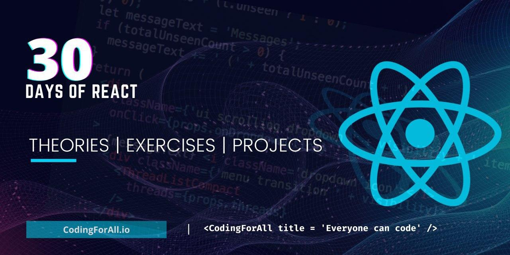

# Hi 👋 !

## I'm Asabeneh Yeatayeh

  
  
  

  

 

I am an _educator_, _programmer_, _fullstack developer_, _motivator_, _content creater_ and _data analyst_.
Technologies which I teach and use:

### Frontend Technologies

### Backend Technologies

### Tools

 
 

<small>
<em>I learned the hard way, why don't you learn the easy-way from me.</em> I usually try to produce a jargon free educational materials.
</small>

<small>Support the <strong>author</strong> to create more educational materials</small>    

<!-- ## 30 Days Of React Challenge

I love _react_. Now, I like to teach _React_ to a global audience. I believe you will get everything you need to use and work with _React_. Let's learn _React_ together for 30 days. I would like to ask you to join this challenge and take your _JavaScript_ and _React_ to the second level.

 

  -->

## Tech Stacks

- MEEN Stack
- MERN Stack
- JAM Stack
- MRF Stack

---

<small> _I am a lifelong learner and I love teaching and inspiring people_. </small>
