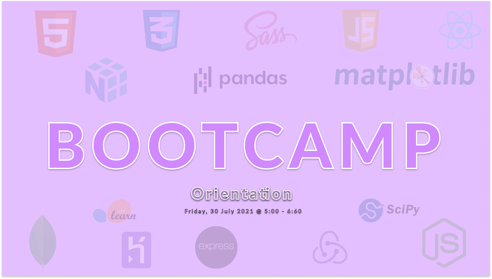

# Hi 👋 !

## I'm Asabeneh Yeatayeh
<small>A place to mine Gold and Diamond! </small>

I am an _educator_, _programmer_, _full-stack developer_, _motivator_, _content creator_ and _data analyst_.

<h1>Join upcoming Bootcamp
<h4> One Month Intensive Bootcamp</h4>
<small> Starts: 2 August 2021</small>

Click here to know more about the <a href ="https://www.linkedin.com/events/bootcamporientation6824450804087324672/" style ="color:red;font-weight:bold">BOOTCAMP</a>

## Technologies which I teach and use:

### Frontend Technologies

  
  
  
  
  
  
  
  
  
  

 

### Backend Technologies

  
  
  
  
  
  
  
  

### Tools

  
  
  
  
  
   

  

  
 ### Support the Author
  
 By Subscribing to the YouTube Channel 
 
 

There are more than 100 videos about  
✅ HTML  
✅ CSS  
✅ Git and GitHub  
✅ JavaScript  
✅ React  
✅ Python  
✅ Data Analysis  
 on <a href="https://www.youtube.com/channel/UCM4xOopkYiPwJqyKsSqL9mw" target="_blank">CodingForAll</a> YouTube channel. You may subscribe the channel for more contents
 

  
  
 ---
  
 

  <small>Support the <strong><em style ="color:red;">author</em></strong> to create more educational materials</small>    

<small>
 I usually try to produce a jargon free educational materials.
</small>

<!-- ## Tech Stacks
- MEEN Stack
- MERN Stack
- JAM Stack
- MRF Stack
 -->

---
<small> _I am a lifelong learner and I love teaching and inspiring people_. </small>
