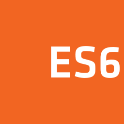
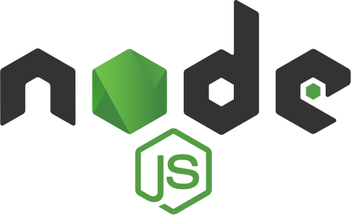
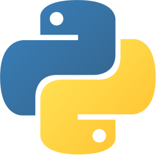
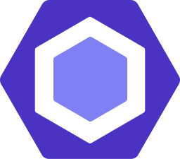
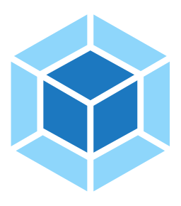
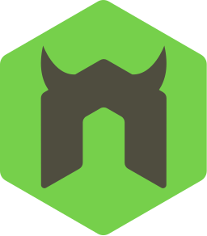

# Hi 👋 Welcome

## I'm Asabeneh S. Yetayeh

I’m an **educator, full-stack engineer, and content creator** passionate about making programming accessible to everyone. My GitHub is packed with **free, high-quality learning resources** on web development, Python, data analysis, and more.

---

## 🚀 Popular Projects & Impact

| Project                                                                    | GitHub Stars | Notes                           | Traffic / Reach      |
| -------------------------------------------------------------------------- | ------------ | ------------------------------- | -------------------- |
| [30 Days of JavaScript](https://github.com/Asabeneh/30-Days-Of-JavaScript) | 45.6 k      | Step-by-step JS challenge       | ~124K biweekly views |
| [30 Days of Python](https://github.com/Asabeneh/30-Days-Of-Python)         | 52.3 k      | Beginner to pro Python learning | ~150K biweekly views |
| [30 Days of React](https://github.com/Asabeneh/30-Days-Of-React)           | 27.2 k      | React fundamentals & projects   | ~78K biweekly views  |

**Millions of developers worldwide** have benefited from these resources, and the combined **biweekly reach of ~352K** demonstrates strong engagement and consistent traffic.

Discover what learners say in this **[testimonial](https://www.asabeneh.com/)** page. 

## Upcoming Live Programming courses
- [DevOsome](https://www.devosome.com/)

---

## 💡 Why Sponsor Me?

* Reach an engaged, growing audience of **developers and learners** worldwide
* Feature your brand in **high-visibility educational projects**
* Collaborate on **tutorials, webinars, or community showcases**
* Support **free, accessible learning resources** that empower the next generation of developers

---

## Featured YouTube Videos

- [Python in 3 Hours](https://www.youtube.com/watch?v=OCCWZheOesI&ab_channel=Washera)
- [Python in 10 hours](https://www.youtube.com/watch?v=ByXRKZtW0lw)
- [Python for Absolute Beginners](https://www.youtube.com/watch?v=LHRn9NMNBCQ&list=PLbvhRHYrmshRFWUrS6x2LgeE4CMte_m5K&ab_channel=Washera)

<!--
## Technologies I Teach and Use

### Frontend

  
  
  
  
  
  
  
  
  
  

### Backend

  
  
  
  
  
  
  
  

<!--
### Tools

  
  
  
  
  
  

-->
---

<!--
## Upcoming Challenges

- **30DaysOfTypeScript**
- **30DaysOfSQL**
- **100DaysOfWeb**
- **10DaysOfBashing**

-->
---

|  |  |
| ------------- | ------------- |

<small><em>I’m a lifelong learner with a passion for teaching and inspiring others.</em></small>

---
👉 Connect with me: [GitHub](https://github.com/Asabeneh) · [LinkedIn](https://www.linkedin.com/in/asabeneh) · [Twitter](https://twitter.com/Asabeneh)  
